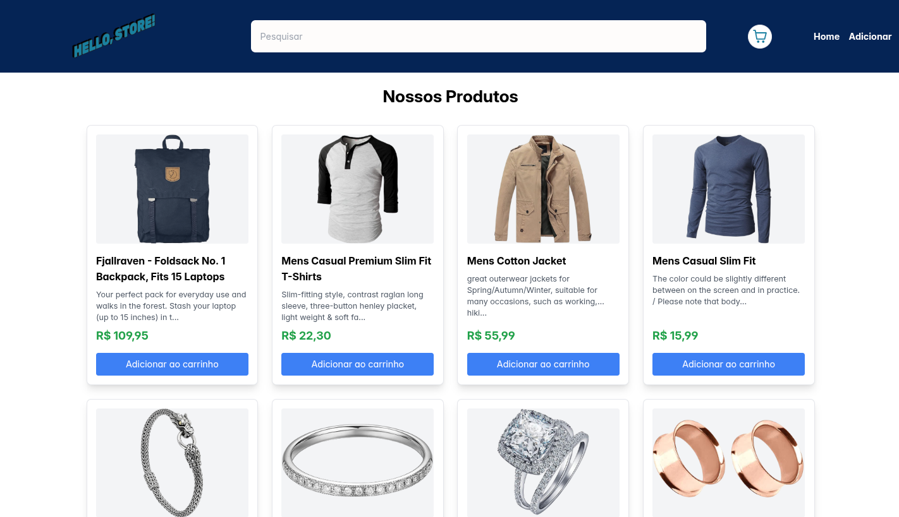
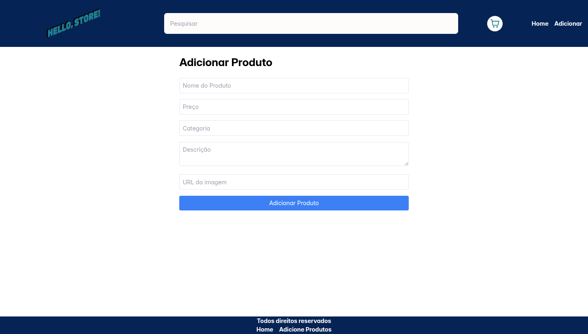

# Mini Loja

Bem-vindo ao projeto **Mini Loja**! Este é um sistema simples desenvolvido para gerenciar produtos, permitindo visualizar e adicionar novos itens.

## 🚀 Tecnologias Utilizadas

Este projeto foi desenvolvido com as seguintes tecnologias principais:

- [React](https://react.dev/)
- [Vite](https://vitejs.dev/)
- [Tailwind CSS](https://tailwindcss.com/)
- [PrimeReact](https://primereact.org/)

## 📸 Capturas de Tela

### Página Inicial

### Adicionar Produto

## 🛠️ Funcionalidades

- **Visualização de Produtos**: Lista de produtos disponíveis na loja.
- **Cadastro de Produtos**: Formulário para adicionar novos itens ao catálogo.

## 👨‍💻 Créditos

Feito com 💜 por **Gabriel Neves**.
